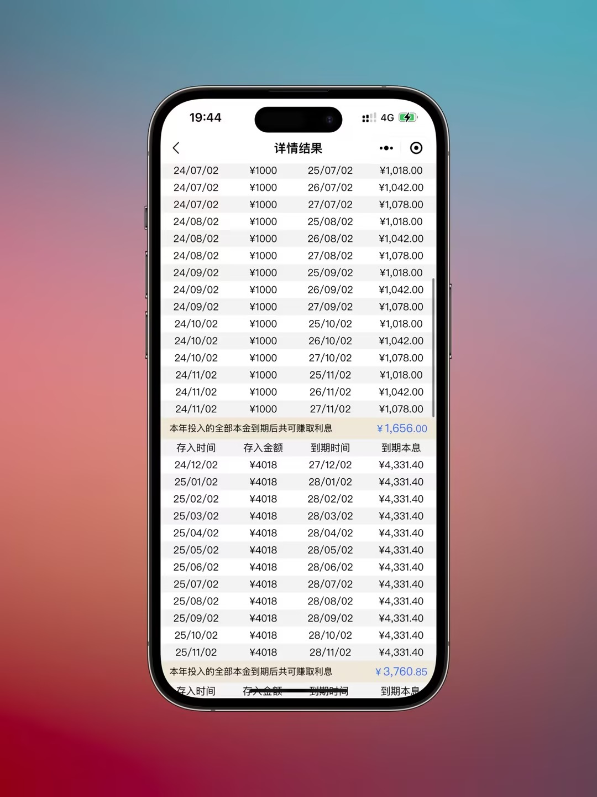

存单计算器
- 一款快速计算 **36存单法** 和 **12存单法** 不同存储方式的收益计算器

## 项目预览

### 36存单法
- 以每个月存 3000 元为例
- 第一年，每月存款平均分成3笔，分别存储一年、二年、三年期，第一年共36张存单
- 第二年，将当月本金3000元加上一年期到期的1000本金和利息一起，再存储三年期,
- 第三年，将当月本金3000元加上二年期到期的1000本金和利息一起，再存储三年期
- 以此类推，一直滚存

 

### 12 存单法
- 以每个月存 3000 元为例
- 每月存3000元，存储三年期，每年12张存单
- 第四年，将当月本金3000元加上到期的3000本金和利息一起，继续存三年期
- 以此类推，一直滚存

